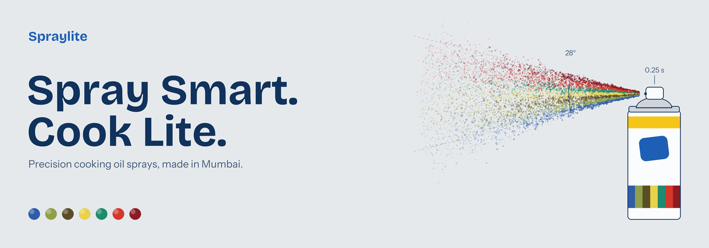
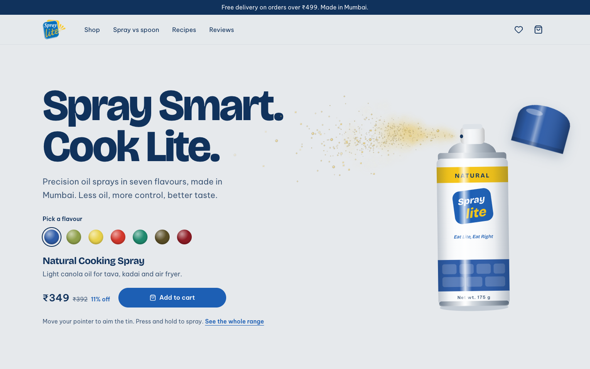
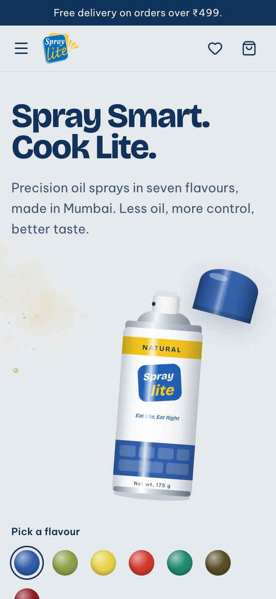
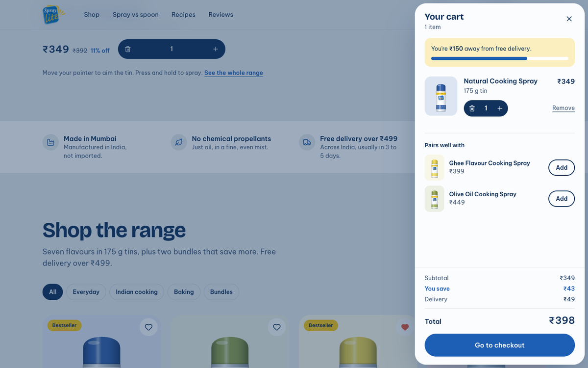
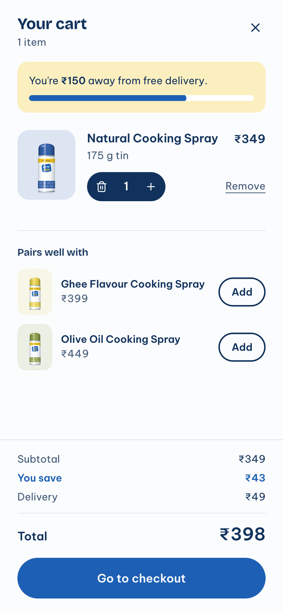

# Spraylite storefront

A responsive e-commerce homepage for **Spraylite**, the Mumbai cooking-spray brand. Built with Next.js 16, React 19, TypeScript and Tailwind CSS v4 for the Visionary Bizz frontend assessment.

- **Live site:** _add the Vercel URL here_
- **Repository:** _add the GitHub URL here_

| Desktop                                                                                | Mobile                                           |
| -------------------------------------------------------------------------------------- | ------------------------------------------------ |
|    |  |
|  |  |

More in [`docs/screenshots`](docs/screenshots).

## What's on the page

- **Hero with a live spray.** Move the pointer to aim the tin; press and hold to spray. The flavour picker swaps the cap, the label and the colour of the mist to match that oil, and adds that flavour to the cart.
- **Shop the range.** Filter by use, sort by price or rating, open a quick view, add to cart (the button becomes a quantity stepper), save to the wishlist.
- **Cart.** Change quantities, remove with Undo, see progress toward free delivery, savings against MRP, the delivery fee, the total, and two flavours that pair well with what's in the cart. Drag or flick the sheet to close it.
- **Wishlist.** Move items to the cart or remove them with Undo.
- **Spray vs spoon.** A nutrition-label comparison, a calculator for the calories and oil saved each month, and how to use the spray.
- **Recipes, reviews, trust points, newsletter.** The newsletter form validates as you type after the first check.
- The cart and wishlist are saved in `localStorage` and stay in sync across browser tabs.

## Getting started

Requires Node.js 20.9 or later.

```bash
npm install
npm run dev
```

Then open http://localhost:3000.

| Script              | What it does                                                 |
| ------------------- | ------------------------------------------------------------ |
| `npm run dev`       | Development server (Turbopack)                               |
| `npm run build`     | Production build                                             |
| `npm start`         | Serve the production build                                   |
| `npm run lint`      | ESLint with the Next.js core-web-vitals and TypeScript rules |
| `npm run typecheck` | TypeScript check, no output                                  |
| `npm test`          | Unit and component tests (Vitest)                            |
| `npm run format`    | Prettier, with Tailwind class sorting                        |

## Tech and libraries

| Library                                                                       | Used for                                                                                          |
| ----------------------------------------------------------------------------- | ------------------------------------------------------------------------------------------------- |
| [Next.js 16](https://nextjs.org) (App Router)                                 | Static rendering, `next/image`, `next/font`, `next/dynamic`, metadata and share-image conventions |
| React 19 + TypeScript                                                         | UI and types, strict mode                                                                         |
| [Tailwind CSS v4](https://tailwindcss.com)                                    | Styling, with the design tokens declared in CSS (`@theme`)                                        |
| [Zustand](https://zustand.docs.pmnd.rs) + `persist`                           | Cart and wishlist state, saved to `localStorage`                                                  |
| [Motion](https://motion.dev)                                                  | Spring animation for sheets, layout changes and badges, loaded lazily through `LazyMotion`        |
| [Radix UI Dialog](https://www.radix-ui.com/primitives/docs/components/dialog) | Accessible sheets and quick view: focus trap, Esc to close, focus return                          |
| [Sonner](https://sonner.emilkowal.ski)                                        | Toasts with Undo                                                                                  |
| [Lucide](https://lucide.dev)                                                  | Icons                                                                                             |
| clsx + tailwind-merge                                                         | Class name composition                                                                            |
| Vitest + Testing Library                                                      | Tests                                                                                             |

There's no UI kit: every component is written for this project.

## Project structure

```
src/
  app/            Root layout, page, global styles and theme tokens, icons, share image
  assets/         Logo and recipe photos (imported, so next/image knows their size)
  components/
    cart/         Cart and wishlist sheets, line items, suggestions, free-delivery meter
    layout/       Announcement bar, header, mobile menu, footer, logo
    mist/         Hero mist: a pure TypeScript particle engine and its React wrapper
    product/      Tin illustration, product card, quick view, price, rating, buttons
    providers/    Motion setup, lazy overlays, toaster, store hydration
    sections/     Hero, shop, spray vs spoon, recipes, reviews, trust strip, newsletter
    ui/           Button, icon button, quantity stepper, sheet, badge, animated number
  data/           Products, recipes, reviews, navigation
  lib/            Pure helpers: cart maths, sort, filter and suggestions, formatting, calories, validation
  store/          Zustand stores: cart, wishlist, UI
  types/          Shared types
docs/design/      Theme and mist notes, README banner
docs/screenshots/ Screenshots at desktop and mobile sizes
```

Business logic lives in plain functions (`src/lib`) and small stores (`src/store`), so it's tested without rendering anything. Components stay thin.

## Design

- **Direction: "Mist & Metal".** The palette comes from the product: an aluminium ground, white tins, the blue and yellow of the logo, and each flavour's real cap colour as its accent. See [`docs/design/theme.md`](docs/design/theme.md).
- **Type.** Bricolage Grotesque for headings, with its optical-size axis so large headlines get the tighter display cut. Be Vietnam Pro for body text, the typeface already used on spray-lite.in.
- **Tins are drawn in code.** Each tin is an SVG built from shared symbols and tinted with its real cap colour through a CSS variable. Tins stay sharp at every size, cost a few DOM nodes each, and can be animated.
- **The hero mist.** A seeded particle system: droplets leave the nozzle in a 28° cone, slow down with drag, sink slightly and drift on a noise field that grows with distance. It uses typed arrays and pre-rendered sprites, starts once the browser is idle, pauses when off screen and stops when nothing is moving. With reduced motion on, it draws a single still frame. How it works is written up in [`docs/design/mist.md`](docs/design/mist.md).
- **Motion answers the user.** Springs start from wherever an element currently is, so they can be interrupted. Sheets close with a flick because the release velocity is projected forward. Feedback happens on press, not on release.
- **Share image.** `src/app/opengraph-image.png` (and the banner above) shows the same idea as a diagram: a line-drawn tin releasing a spray in the seven cap colours.

## Accessibility

- Landmarks, a skip link, one `h1` and a labelled heading for every section.
- A visible focus ring everywhere. The flavour picker is a radio group with arrow-key support. After "Add to cart", focus moves to the new stepper; after removing the last item, it moves back to "Add to cart". After removing a cart line, focus moves to its Undo button.
- Sheets and dialogs trap focus, close with Esc and return focus to the button that opened them.
- Live regions announce filter results and changes; icon-only buttons have labels; prices are read with their MRP and discount.
- Respects `prefers-reduced-motion`, `prefers-reduced-transparency` and `prefers-contrast`. Text meets WCAG AA contrast.

## Performance

Lighthouse 12 against the production build (`npm run build && npm start`), default simulated throttling:

|         | Performance | Accessibility | Best practices | SEO |
| ------- | ----------- | ------------- | -------------- | --- |
| Mobile  | 91          | 100           | 100            | 100 |
| Desktop | 100         | 100           | 100            | 100 |

Mobile: LCP 3.5 s, total blocking time under 50 ms, CLS 0. What got it there:

- The page is statically rendered; client components are used only where there's interaction.
- The cart, wishlist, quick view and mobile menu are loaded with `next/dynamic` when the browser is idle, or the moment someone opens one, so the dialog code isn't in first-load JavaScript.
- Motion's animation features load lazily through `LazyMotion`; components use the lightweight `m` elements.
- The hero mist boots once the browser is idle, never during first paint.
- Tins are `<use>` references to shared SVG symbols, which cut the page from about 1,240 DOM nodes to about 870.
- Fonts are self-hosted by `next/font` and kept to what's used. Photos are served as AVIF or WebP at the right size, with blur placeholders.

## Tests

`npm test` runs 64 tests: cart maths and delivery fees, the cart and wishlist stores (including Undo and stale data in storage), sorting, filtering and cart suggestions, price formatting, the calorie calculator, email validation, the mist engine's seeded maths, and component behaviour for the add-to-cart stepper and the cart sheet.

## Content and credits

- Flavours and cap colours follow the real Spraylite range. **Prices, ratings and reviews are placeholders**, and the footer says so.
- Logo from Spraylite's launch page, [spray-lite.in](https://www.spray-lite.in).
- Food photography from [Unsplash](https://unsplash.com) (Unsplash License): [Pavan Reddy](https://unsplash.com/photos/JJhZ34RRyfk), [Ashwini Chaudhary (Monty)](https://unsplash.com/photos/ne2zRzZZZNY), [Will Echols](https://unsplash.com/photos/P_l1bJQpQF0), [Orijit Chatterjee](https://unsplash.com/photos/wEBg_pYtynw) and [Taylor Kiser](https://unsplash.com/photos/EvoIiaIVRzU).

## Deployment

The site deploys to Vercel with no configuration: import the repository and deploy.
